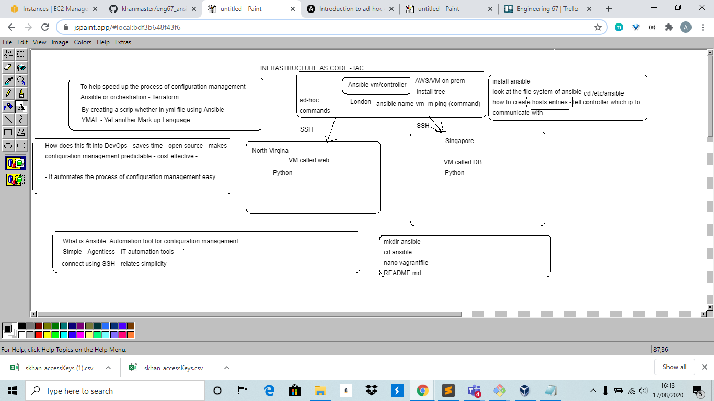

# Ansible Theory

## Infastructure as code (IAC)

**Definition**

- Speeds up process of configuration management
- Uses Ansible or orchetrastation

**Why is it effective**

- Ansible VM controller manages multiple servers
        - In real life may have up to 60 servers, so automatic control is needed



## Ansible

**Why use Ansible**

- Simple
        - Connect with SSH key into servers
- Agentless
        - No need for additional software on your software nodes
        - Much less dependencies. Often just need to run update command on machines
- Written in Python
        - Python automatically installed in linux, so not needed to be installed
- Playbooks are easy to read and edit
        - Mostly written in YAML, good compared to other solutions e.g. Puppet

**How it fits into DevOps**

- Open source
- Saves time through automation of configuration management
- Makes everything predictable, so enviroment is set up by uniform standard
- Reduces errors at run time, so saves money
- Doesn't care if machines are AWS, hybrid vagrant etc.

**How it works**

- Ansible installed on controller(type of virtual machine)
- Create script in YMI file using Ansible
- YAML = Yet another markup language
- Used in cyper security
        - Software cube used to detect potential threats
        - Adds IPs to subnets

## Ansible Playbooks

**What are they**

- YAML files, .yml extension
- Automates the tasks in multiple servers

**Why we use them**

- Used to install software across multiple machines
- For configuration management

**Creating a playbook**

- See above (Step 11)

**YAML Languague**

- Yet another markdown language
- Files start with ```---```
- States are:
        - Present
        - Absent
        - Latest (most up to date version)

## Ansible ad-hoc command exercise

```ansible all -m shell -a "ls -a"```

```ansible all -m copy -a "src=/home/vagrant/TESTFILE.md dest=/home/vagrant"```

```ansible all -m shell -a "cat TESTFILE.md"```

```ansible all -m shell -a "echo 'I love ansible' > TESTFILE.md"```

```ansible all -m setup```

**Find out up-time**

```ansible web -a "uptime"```

**Find out env variables**

```ansible all -a "env"```

**Find out IPs**

```ansible all -a "hostname -I"```

**Find out disk space**

```ansible all -a "free"```

- For more information see below

```https://www.tecmint.com/commands-to-collect-system-and-hardware-information-in-linux/```


## More resources

https://docs.ansible.com/ansible/latest/index.html

