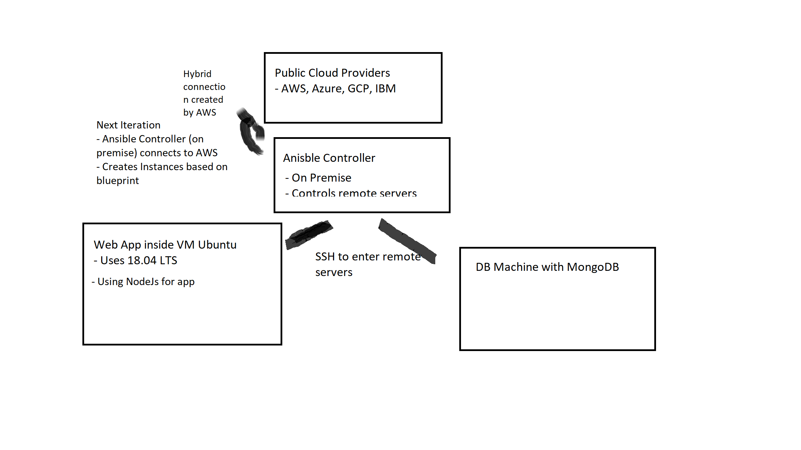

# Networking concepts

## Ansible Networking

- What we setup using Ansible and Virtual machines

- Use of AWS with Ansible creates hybrid cloud
        - This had security concerns as cloud does not handle security of data in transfer
        - Data security is gurannted by password encryption (Ansible vault so access keys hidden)

- Private cloud (local network/on premise storage) combined with public cloud
        - Public Cloud is AWS Data Storage
        - Hybrid cloud used by Government bodies, Passport no. stored on premise/private cloud
        - Website information, non - confidentail information stored on public cloud.
        - Part of disaster recovery

**Disaster recovery plan**

- Automatic redirection from AWS server to different server
- E.g. London server goes down and Ireland server takes up slakc
- AWS goes down and Azure used in multi cloud to ensure services still running

**Load balancing**

- On AWS is known as Elastic Load balancing
- Automaticaly distrubutes incoming traffic acorss multiple targets
        - E.g. EC2s, Containers, IPs and Lambda functions
- Uses three types
        - Application (HTTP and HTTPs for traffic)
        - Network (For VPCs and volatile traffic patterns)
        - Classic (basic balancing across EC2 instances build in EC2 classic network)

**AWS Route 53**

- A DNS service, part of disaster recovery plan
- AWS Route 53 used to automate user requests routing and assess health of servers
- Allows smart and automated traffic routing based on:
        - latency
        - endpoint(server) health
        - geographic location

**Mutable vs Immutable**

- Servers that can be entered with SSH and have software installed are mutable
- In immutable infastruture a server once created from image are immutable
        - More conistencty and reliablility
        - More predicatble deployment and less issues

- For immutable infastructure need to have setup things already
        - Needs comprehensive deployment automation
        - Fast server provisioning
        - Solutions for handling stateful or ephermeral data like logs

https://www.digitalocean.com/community/tutorials/what-is-immutable-infrastructure

**Cloud watch**

- Used on AWS to monitor applcations, respond to perforance changes and optimise resource use. 
	- 

## Automation Tools we have use

- Ansible
        - Infastrucuture as code
- Jenkins
        - Automates Continuous Integration, Delivery and Deployment
- Vagrant
        - Uses Dev environmnet tools
        - Provision script to auto set up server
- Cloud
        - Cloud formation AWS
        - Ansible has lots of transferable skills
        - Playbook can add hosts to install software easily on mutltiple machines
        - May need to change apt > yam but otherwise just need to change variables
        - Flexible and scalablae configuriaton management

## Buzzwords

- Replicate of servers using docker etc. 
	- Spins up automatically and scales on demand	
	- Closes once not needed

## Non scalable or highly available app

### Machine

Linx

### What is it

App

### Security

VPC

### Scalable or Available

No

## Making scalable and available app

### Machine

- Multi systems supported 
	- multiple app servers to host multiple compatible version

### What is it

- N tier architcture with web app
- ## Why use cloud?

### Old days 

- When demand surged would scale up to 150 GB
	- Sunk cost however as cannot scale down

- When traffic goes back down
	- Cannot scale down
	- Money already spent

- Would have single server in your office
	- Scale up would be to use more servers
	- Now have more resource opportunities with cloud

### Modern day

- When demands surge cloud computing scales up
	- Flexible cost
	- Define maximum and minium instances
- When traffic goes back down
	- Less instances used
	- Costs saving
- Auto scaling group
	- Auto scales based on maximum and minimum instances
	- Health checks and notifications to see when 80% of computing power used
- If bank, govt etc, can use hybrid cloud
	- On premise data storage
- Monitor with Route 53 
	- Person on site told if CPU usage above 80% etc.Load balancing tier
	- Route 53 to ensure avaialbityy
- Web tier with nginx to create web connection
- App tier 
- Cache tier for ephermal tier
	- Shifts load from DB as it is not reqpeatdly queied
	- Enables auto scaling
- DB tier
	-  Where DB is stored

### Security

- Use route 53 to set up private doman name system

### Scalable

- Scale up with more powerful EC2 or out with more EC2s
	- Micro services
	- Use ansible wiht micro services (infastrucute automation_
- Pay for what you use
	- Use billing alerts and cost caluclator

### Available

- Use multuple availablity zones (Clusters of data servers)
	- Ensures service outage less likely
	- Cache tier
- Maintain back up systems for back up
	- Along with virtualised servers for zero down time
- Could even spread out to multiple service providers
	- Azure and AWS

## Why use cloud?

### Old days 

- When demand surged would scale up to 150 GB
	- Sunk cost however as cannot scale down

- When traffic goes back down
	- Cannot scale down
	- Money already spent

- Would have single server in your office
	- Scale up would be to use more servers
	- Now have more resource opportunities with cloud

### Modern day

- When demands surge cloud computing scales up
	- Flexible cost
	- Define maximum and minium instances
- When traffic goes back down
	- Less instances used
	- Costs saving
- Auto scaling group
	- Auto scales based on maximum and minimum instances
	- Health checks and notifications to see when 80% of computing power used
- If bank, govt etc, can use hybrid cloud
	- On premise data storage
- Monitor with Route 53 
	- Person on site told if CPU usage above 80% etc.
