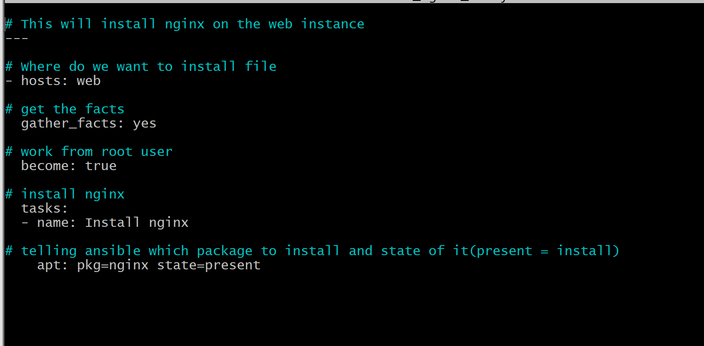

# Ansible

## Dependencies

**Git Bash**

- This is used to access and manipulate the machines
- Download it here (alongside other git software): https://git-scm.com/downloads


**Python**

- This is auto installed with Git Bash and Linx often however
- This shows the simplicity of Ansible as there is minimal dependencies

## Steps

### 1. Clone this repositry

- As per GitHub commands, fork then download. 

### 2. Run vagrant file

```vagrant up```

- This may take a while on the first go

### 3. Once the machines are up enter each and update them

```
vagrant status
vagrant ssh web/aws/db
sudo apt-get update
```
 
- Run the update command for each machine

### 4. Make the AWS server the controller server

A. Install ansible (within the AWS server)

```
sudo apt-get install software-properties-common -y
sudo apt-add-repository --yes --update ppa:ansible/ansible
sudo apt-get update
sudo apt-get install ansible
```
B. Check installation

```ansible --version```

C. Install tree

- This is a package manager

```sudo apt-get install tree```

D. Examine tree

```
cd /etc/ansible
tree
```

- This will display files in user friendly way

### 5. Test connection to other VMs

```
ping 192.168.33.10
ping 192.168.33.11
```

- This chould how bytes coming from the IPs
- However you do not have access to the servers yet

### 6. Set up access to the servers from the controller server (aws)

```sudo nano hosts```

- Add the below text into the file
- This creates hosts for connections to other servers

```
[web]
192.168.33.10 ansible_connection=ssh ansible_ssh_user=vagrant ansible_ssh_pass=vagrant

[db]
192.168.33.11 ansible_connection=ssh ansible_ssh_user=vagrant ansible_ssh_pass=vagrant

# [aws]
# 192.168.33.12 ansible_connection=ssh ansible_ssh_user=vagrant ansible_ssh_pass=vagrant
```

### 7. Connect to the other machines 

```ssh vagrant@192.168.33.10```

- Enter password as "vagrant".
	- You will not be able to see the password entered
- This should give you access to the machine

- Repeat for the DB machine

```ssh vagrant@192.168.33.11```

### 8. Ping machines with Ansible command

```ansible all -m ping```

- This will ping connection to web and db
- If succesful it will display a green message saying success

### 9. Interact with other servers and get information

- Run commands from the Anisble Controller server

```
ansible web -a "date"
ansible db -a "uname -a"
```
- Gets date and time of the web server
- Then current operating system of machine
- "-a" gets all information

```ansible all -m shell -a "ls -a"```

- Goes into all servers and runs command in shell (bash) format
- Returns result of command being run in each server

### 10. Create playbook

```
sudo su
nano filename.yml
```

- Start file with comment, then --- 
- Identation very important
- Follow example of install_nginx_web.yml



### 11. Run playbook

- You have to exit root mode

```
exit
ansible-playbook install_nginx_web.yml
```

### Ansible ad-hoc command exercise

```ansible all -m shell -a "ls -a"```

```ansible all -m copy -a "src=/home/vagrant/TESTFILE.md dest=/home/vagrant"```

```ansible all -m shell -a "cat TESTFILE.md"```

```ansible all -m shell -a "echo 'I love ansible' > TESTFILE.md"```

```ansible all -m setup```

**Find out up-time**

```ansible web -a "uptime"```

**Find out env variables**

```ansible all -a "env"```

**Find out IPs**

```ansible all -a "hostname -I"```

**Find out disk space**

```ansible all -a "free"```

- For more information see below

```https://www.tecmint.com/commands-to-collect-system-and-hardware-information-in-linux/```

## Ansible Playbooks

**What are they**

- YAML files, .yml extension
- Automates the tasks in multiple servers

**Why we use them**

- Used to install software across multiple machines
- For configuration management

**Creating a playbook**

- See above (Step 11)

**YAML Languague**

- Yet another markdown language
- Files start with ```---```
- States are:
	- Present 
	- Absent
	- Latest (most up to date version)

## Infastructure as code (IAC)

**Definition**

- Speeds up process of configuration management
- Uses Ansible or orchetrastation

**Why is it effective**

- Ansible VM controller manages multiple servers
	- In real life may have up to 60 servers, so automatic control is needed

 

## Ansible

**Why use Ansible**

- Simple
	- Connect with SSH key into servers
- Agentless
	- No need for additional software on your software nodes
	- Much less dependencies. Often just need to run update command on machines
- Written in Python
	- Python automatically installed in linux, so not needed to be installed
- Playbooks are easy to read and edit
	- Mostly written in YAML, good compared to other solutions e.g. Puppet

**How it fits into DevOps**

- Open source
- Saves time through automation of configuration management
- Makes everything predictable, so enviroment is set up by uniform standard
- Reduces errors at run time, so saves money
- Doesn't care if machines are AWS, hybrid vagrant etc.

**How it works**

- Ansible installed on controller(type of virtual machine)
- Create script in YMI file using Ansible
- YAML = Yet another markup language
- Used in cyper security
	- Software cube used to detect potential threats
	- Adds IPs to subnets

## More resources

https://docs.ansible.com/ansible/latest/index.html
